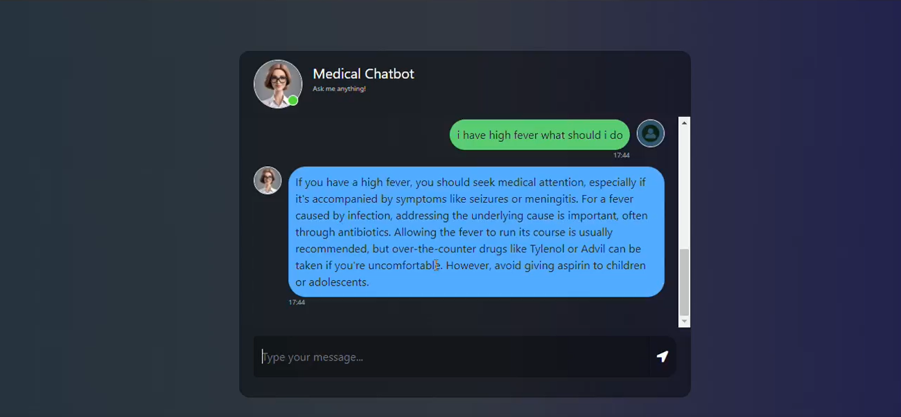

# Medical-ChatBot

This project implements a medical chatbot using the GROQ query language to access the Mistral LLM, trained on the "The Gale Encyclopedia of Medicine 2nd Edition." The chatbot leverages the Pinecone vector database to store and retrieve relevant medical information.

## Key Features
* **Natural Language Processing:** Utilizes the Mistral LLM to understand and respond to user queries in natural language.
* **Knowledge Base:** Leverages the "The Gale Encyclopedia of Medicine 2nd Edition" as a comprehensive source of medical information.
* **Vector Database:** Employs Pinecone to efficiently store and retrieve relevant information based on semantic similarity.
* **GROQ Queries:** Uses GROQ to query the knowledge base and extract pertinent information.

## Future Improvement

* **Enhanced Knowledge Base:** Incorporate more diverse medical datasets to broaden the chatbot's knowledge.
* **Contextual Understanding:** Improve the chatbot's ability to maintain context throughout the conversation.
* **Personalized Responses:** Tailor responses to individual user needs and preferences.
* **Ethical Considerations:** Implement safeguards to prevent the dissemination of harmful or misleading medical information.

## Preview

